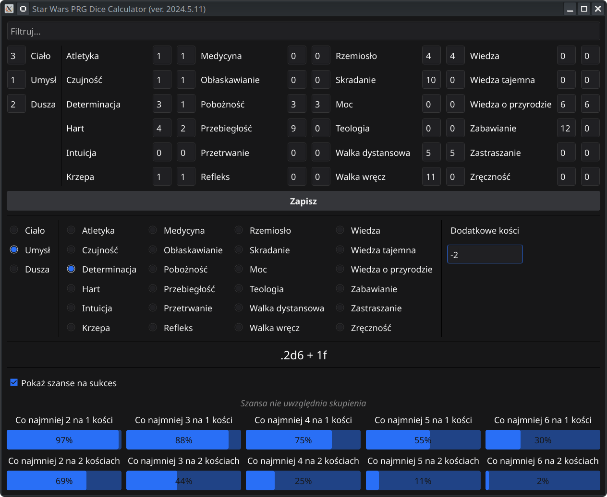

# StarWarsRPG-DiceHelper

Personal project for making RPG sessions easier with a dedicated calculator program.

## Why `go`, why `fyne`?

I wanted to take this opportunity to learn some more Go as I like the language.  
As this was the GUI app I decided to check out `fyne` as the docs were good enough for a newcomer like me.  
Additionally, the cross-compilation tool `cross-fyne` made my job much easier to make the app run on Linux and Windows.
